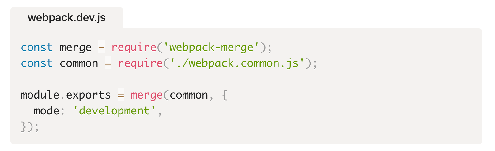

# gatsby-remark-code-headers

Adds a customizeable header, like a filename, to code blocks for Gatsby.js.

[](https://travis-ci.com/vzhou842/gatsby-remark-code-headers) 



See this plugin being used live at [victorzhou.com](https://victorzhou.com/blog/build-an-io-game-part-1/) ([source code](https://github.com/vzhou842/victorzhou.com)).

## Installation

You must be already using [gatsby-transformer-remark](https://www.gatsbyjs.org/packages/gatsby-transformer-remark/). To install, run

```bash
$ npm install --save-dev gatsby-remark-code-headers
```

Then, in `gatsby-config.js`, update your options for `gatsby-transformer-remark`:

```js
plugins: [
  {
    resolve: 'gatsby-transformer-remark',
    options: {
      plugins: [
        {
          resolve: 'gatsby-remark-code-headers',
          options: {
            className: 'optional-custom-class-name'
          }
        }
      ]
    }
  }
]
```

## Usage

In your Markdown file, add a **header comment** to the first line of any code block:

~~~markdown
### Code

```js
// Header: filename.js
console.log('This is filename.js');
```

```python
# Header: This is a Python file
print('Hello World!')
```
~~~

**The header comment must be formatted exactly like one of the examples above**. This plugin will replace the header comment with HTML for the header. It effectively transforms the above markdown into this:

~~~markdown
### Code

<div class="gatsby-code-header"><h5>filename.js</h5></div>
```js
console.log('This is filename.js');
```

<div class="gatsby-code-header"><h5>This is a Python file</h5></div>
```python
print('Hello World!')
```
~~~

### Styling

Once your integration works, you'll probably want to style the code header. Here's some example CSS you can use as a starting point:

```css
.gatsby-code-header {
  margin: 10px 0 0 0;
}

.gatsby-code-header h5 {
  display: inline-block;
  margin: 0;
  padding: 2px 20px;
  background-color: rgb(245, 242, 240);
  border-top-left-radius: 5px;
  border-top-right-radius: 5px;
  border-bottom: 1px solid gray;
}
```
